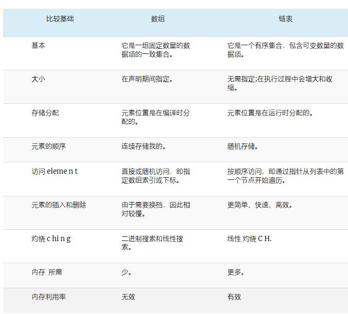

# 面试

https://docs.google.com/document/d/18HMyd-lFu1hWiixFLS2Pc7-SgyzDDqitzXbfAnUVeBE/mobilebasic

## 操作系统

### 1描述继承、多线程、看门狗定时器等

    继承 ：继承允许我们根据另一个类定义一个类，这使得创建和维护应用程序变得更加容易。  继承允许在功能上重用代码，并允许快速实现
    多线程： 多线程是程序一次管理多个用户使用的能力，甚至可以管理同一用户的多个请求，而无需在计算机中运行多个程序副本。
    看门狗定时器 ：WDT 是一种硬件，可用于自动检测软件异常并在发生任何异常时重置处理器。 

### 2 什么是 虚拟内存 和 缓存 （另请阅读缓存一致性）

    物理内存在机器中是稀缺的，因此虚拟内存是扩展它的优化
    存储在硬盘页面中的内存以及使用缓存存储的内存 

### 3 什么是 优先级反转、重入、自旋锁

    优先级反转： 使用信号量运行的优先级较低的任务，等待信号量的优先级较高的任务。中等优先级任务 中断 、运行，然后高优先级任务可以运行 

        解决方案是将低优先级的优先级提升到最高优先级，然后它不能被中优先级抢占（这称为优先级继承） 

    重入： 函数在执行过程中被中断时是可重入的，它可以返回并恢复功能，而无需任何更改 

        不能使用全局/静态数据 

    旋转锁 ：任务正在等待某个被锁定的资源，并不断检查它是否打开，使用大部分 CPU 资源 

    好的经验法则 - 在用户代码中避免它们 

### 4 什么是原子编程/非锁定操作？

    原子操作是保证保持其值安全的操作 

    原子数 在计算机编程中，如果保证计算机执行的操作 atomic 与可能同时发生的其他操作隔离，则该操作被认为是原子操作。换句话说，原子操作是不可分割的。

### 5什么是并发、并行和多线程？

    当我们谈论至少两个或更多任务时，并发 基本上适用 。当一个应用程序能够几乎同时执行两个任务时，我们称之为并发应用程序 。虽然这里的任务看起来像是同时运行的，但本质上它们可能不是。 它们利用操作系统的 CPU 时间切片 功能，其中每个任务运行其任务的一部分，然后进入等待状态。 当第一个任务处于等待状态时，CPU 将分配给第二个任务以完成其任务的一部分。 因此，基于任务优先级的操作系统分配CPU和其他计算资源，例如内存;轮流处理所有任务并给它们完成的机会。 对于最终用户来说，似乎所有任务都是并行运行的。这称为并发。
    并行性 不需要存在两个任务。它通过 为每个任务或子任务分配一个内核，同时使用 CPU 的多核基础设施，从物理上运行部分任务或多个任务。 从本质上讲，并行性需要具有多个处理单元的硬件。 在单核 CPU 中，您可能会获得并发性，但不会获得并行性。 

### 6线程和进程之间的区别

    进程 具有执行程序所需的所有资源 - 内存空间、寄存器、堆栈空间、安全性等
    线程 是一行执行，存在于进程中 

### 7互斥和信号量？ 它们之间的主要区别是什么？ 二进制信号量和互斥锁有什么区别？ 锁定是如何发生的？

    互斥锁用于对资源的独占访问。二进制信号量应用于同步（即“Hey Someone！这发生了！
    任务之间的信号量信号 

    B 给出信号量，A 接受它，任务不给予并自行接受它 

        https://stackoverflow.com/questions/62814/difficult ference-between-binary-semaphore-and-mutex   

### 8 什么是捶打？ 什么是过度分页？在相信上看到的主要领域，因为它不是

    具有 > RAM 大小的虚拟内存
    因此，操作系统不断地在虚拟内存中交换内容
    捶打是指这使用大部分处理能力 

### 9什么是 动态加载？ 什么是静态加载？ 何时使用动态加载？ 有什么优点？ 举例说明何时使用动态加载？

    动态加载是指将代码动态加载到内存中
    静态是指在编译时全部解析 

### 10 常规操作系统与实时操作系统的区别

    用于时间关键型系统的实时操作系统
    RTOS 中的任务调度是基于优先级的，在常规操作系统中是高吞吐量
    RTOS 中的内核是可抢占的 

    如果收到高优先级请求，他们可以抢占操作系统请求 

### 11 操作系统概念 - 什么是互斥？

    当两个进程尝试进入一个关键区域时，其中一个进程将被阻止 

### 12操作系统程序的优先级？

    EL0 - 一般应用
    EL1 - 操作系统
    EL2 - 虚拟机管理程序
    EL3 - 安全的东西

### 14

    https://leetcode.com/discuss/interview-question/124638/what-happens-in-the-background-from-the-time-you-press-the-Power-button-until-the-Linux-login-prompt-appears/ 

## C/C++

### 1 C语言中的静态是什么？static

静态变量是在整个函数调用过程中维持其值的变量。
函数内部的静态变量在不同次函数调用之间保持其值。
在一个文件中声明的静态全局变量或静态函数仅在这个文件内“可见”。

### 2 什么是volatile关键字？

while（!flag）时避免flag值编译优化时省略
volatile关键字用于声明易失性变量，这种变量可以被外部事件（如硬件设备）修改，即使在程序没有运行的情况下也可能发生变化。因此，每次访问volatile变量时，编译器都会从内存中读取其值，而不是从寄存器或其他缓存中获取，以确保得到的是最新的值。这在处理硬件中断、多线程编程等场景中特别重要，因为在这些情况下变量的值可能会在任何时刻被外部因素改变。
A volatile variable can change unexpectedly and compiler cannot make any assumptions about it
http://www.drdobbs.com/cpp/volatile-the-multithreaded-programmers-b/184403766 

### 3 链表和数组的区别？何时使用链表？

链表位于堆内存中，其内存是动态分配的。

链表依赖于引用机制，其中每个节点包含了数据和指向前后相邻元素的引用。

数组是一块连续的内存区域，存储在顺序的内存位置上。

数组是一种基于索引的数据结构，其中每个元素与一个索引相对应。

在需要频繁插入和删除元素的场景下，使用链表可能更为高效，因为链表在进行插入和删除操作时不需要移动大量元素来保持连续性，而数组则可能需要移动多个元素来调整索引位置。另外，当无法预先确定数组大小或者数组大小可能变化时，链表也是更好的选择，因为它可以在运行时动态地增加或减少节点数量。


何时使用链表：
当你需要在列表中进行常数时间的插入/删除操作时（例如，在实时计算中，时间可预测性至关重要）
当你不知道列表中会有多少项。使用数组时，如果数组增长过快，你可能需要重新声明并复制内存。
当你不需要随机访问列表中的任意元素时
当你需要能够在列表中间插入项目时（例如，优先队列）

### 4 什么是悬空指针？何时使用它们？

悬空指针是指向已被释放内存的指针。这块存储空间已经不再被分配。试图访问它可能会导致段错误（Segmentation fault）。指向已被删除（或释放）的内存地址的指针被称为悬空指针。
内存泄漏指的是未被释放的内存，现在没有办法访问（或释放它），因为已经没有途径可以到达这块内存了。
悬空指针并不是有意使用的。它们根本不应该被使用，因为它们会导致程序崩溃和段错误。同时，它们会无谓地占用内存空间。因此，必须非常小心，在删除指针指向的变量之前，应当释放或使指针无效化（置为NULL）。这样可以避免产生悬空指针，从而防止潜在的程序错误。

### 5 什么是结构体和联合体？何时使用哪一个？它们的大小如何？

结构体中的每个成员在内存中都有自己的存储位置。
联合体的大小等于其最大成员的大小。
联合体中一次只能有一个成员拥有值。

联合体在以下情况下使用：
创建一个区分联合（discriminated union）。这可能是你所想到的“空间优化”。
还需要额外的一小部分数据来知道联合体中哪个成员是“活跃的”（即其中含有有效数据）。

总结来说，结构体用于组合多个不同类型的成员，每个成员在内存中都有独立的位置，因此结构体的总大小是所有成员大小的总和。而联合体用于存储几种类型中的一种，所有成员共享同一块内存，因此联合体的大小只取决于最大的成员。在需要空间优化，且数据类型互斥时，使用联合体会更加合适。

### 6 free()函数是如何工作的？它是如何知道要释放多少内存的？

<https://stackoverflow.com/questions/1957099/how-do-free-and-malloc-work-in-c>
当你使用malloc分配内存块时，实际上分配的内存比你请求的要多。这额外的内存被用来存储诸如已分配块的大小信息，以及链表中下一个空闲/已使用块的链接。这些信息对于内存管理器来说至关重要，它帮助malloc和free函数跟踪内存的使用情况和管理。

当你调用free释放指针时，它利用那个地址去查找在你分配的内存块开头（通常是这个位置）添加的特殊信息。这个信息包含了malloc时记录的关于内存块的详细资料，包括块的大小和链表的链接信息。如果传递给free的地址与原分配地址不符，它将会访问到包含无用数据（垃圾数据）的内存区域，这时的行为是未定义的，最常见的结果是程序崩溃。

这是因为free函数依赖于malloc在分配内存时附加的元数据来正确地释放内存。如果传递给free的地址不正确，它尝试访问和操作的元数据也将是错误的，这可能导致内存破坏、数据损坏或程序直接崩溃。因此，确保在调用free时使用正确的指针地址是非常重要的

### 7 类和对象的区别是什么？是类还是对象创建内存？基本上学习关于类和对象的所有细节及定义

类和对象的区别是什么？是类还是对象创建内存？基本上学习关于类和对象的所有细节及定义。

类是静态的，它们只是定义了对象的属性。当一个类被实例化时，它就变成了一个对象，并占用了内存。

类：在C++中，导致面向对象编程的基本构建块是类。它是一个用户定义的数据类型，拥有自己的数据成员和成员函数，这些可以通过创建该类的实例来访问和使用。类就像是一个对象的蓝图。

对象：是类的一个实例。当一个类被定义时，没有内存被分配；但是当它被实例化（即创建了一个对象）时，内存就被分配了。

举例说明：如果频道是一个类，那么Star Sports、BBC和ESPN都是它的对象。

一个“汽车”类：它的对象可以是现代（Hyundai）、福特（Ford）、铃木（Suzuki）。这些对象拥有相同的方法，但具有不同的设计——这就是你可以将现实世界中的对象和类联系起来的方式。

总结来说，类定义了对象的结构和行为，相当于一种模板或蓝图，描述了对象的属性和方法。而对象则是根据类的定义创建的具体实例，它在内存中占有实际的空间，存储着特定的数据，并能够执行类中定义的功能。当一个类被定义时，它不会直接占用内存，只有当通过类创建了对象时，才会在内存中为这个对象分配空间。

### 8 虚函数是什么？它们如何被使用？为什么使用它们？何时使用？示例？irtual functions

虚函数是用来实现运行时多态性的手段。
它们在基类中定义，并在派生类中重写（覆写）。
例如，输入车辆的信息，但不确定是轿车、巴士还是卡车。
虚函数是在基类中声明的成员函数，由派生类重新定义（覆写）。当你使用指向基类的指针或引用基类的引用，来引用派生类的对象并调用虚函数时，会执行派生类中版本的函数。

虚函数确保无论使用何种类型的引用（或指针）来调用函数，都能为对象调用正确的函数。
它们主要用于实现运行时多态性。
在基类中，函数被声明为带有virtual关键字。
函数调用的解析是在运行时完成的。

举例说明：
假设我们有如下类结构：

基类 Vehicle 中有虚函数 displayType()；
派生类 Car, Bus, 和 Truck 分别从 Vehicle 继承并覆写了 displayType() 方法。

```c++
    class Vehicle {
    public:
        virtual void displayType() { cout << "Vehicle" << endl; }
    };

    class Car : public Vehicle {
    public:
        void displayType() override { cout << "Car" << endl; }
    };

    class Bus : public Vehicle {
    public:
        void displayType() override { cout << "Bus" << endl; }
    };

    class Truck : public Vehicle {
    public:
        void displayType() override { cout << "Truck" << endl; }
    };

    int main() {
        Vehicle* myVehicle = new Car();
        myVehicle->displayType(); // 输出 "Car"
        
        delete myVehicle;
        return 0;
    }
```

### 9 乘法是如何实现的？

设置结果为0
重复以下步骤：
将第二个乘数左移，直到其最右边的数字与第一个乘数中最左边的1对齐
将第二个乘数在该位置加到结果上
从第一个乘数中去掉这个1
直到第一个乘数变为零为止

### 10设计电梯系统

设计电梯系统时，我首先思考了系统中需要追踪多少个按钮（包括电梯内部的按钮，以及每层楼外部的按钮）。

之后，我考虑了如何实现中断服务例程（ISR）以及应该使用什么数据结构（可能是一个队列用于存储下一个目标楼层，以及一个数组用于存储所有按钮的状态）来追踪这些按钮的状态，并利用这些信息来控制电梯的运行。

### 11 后缀递增运算符

后缀递增运算符（post-increment operator），通常表示为`i++`，其工作原理是在使用变量的当前值之后，才将变量的值增加1。这意味着在表达式中，变量的原始值会被使用，然后变量的值才会被增加。

例如，考虑以下C/C++代码片段：

```c
int i = 5;
int j = i++; // 此时j的值为5，之后i的值增加为6
```

在这个例子中，`i++`首先返回`i`的当前值5给`j`，然后`i`的值增加1，变成6。因此，`j`的值保持为5，而`i`的值变为6。

这种行为与前缀递增运算符`++i`相反，后者会先增加变量的值，然后再使用新的值。理解这两种递增运算符的区别对于编写正确的代码逻辑非常重要，尤其是在循环和迭代等场景中。

### 12  一位提问者询问如何修改malloc以确保它是32字节对齐的

当被问及如何修改malloc以确保分配的内存地址是32字节对齐时，可以通过掩码操作ptr & ~0x1F来实现。这里的0x1F是一个十六进制数值，等于十进制的31，它的二进制形式是00011111，正好是5个1。当我们将指针ptr与~0x1F（即0xFFFFFFF0）进行与操作时，实际上是清除了指针值最后的5位，从而确保指针的值是32的倍数，即实现了32字节的对齐。

在计算机系统中，对齐（Alignment）是指数据在内存中的存储位置与数据类型大小的关系。良好的对齐可以提高数据访问速度，因为许多处理器在非对齐位置访问数据时会降低性能。例如，访问一个32位或64位的整数时，如果这个整数的地址不是4字节或8字节的倍数，处理器可能需要进行额外的操作来读取或写入数据，这会降低效率。

在malloc函数中，内存分配器通常会考虑对齐要求，确保返回的指针满足特定的对齐条件。然而，如果你需要特定的对齐，比如32字节对齐，可能需要在malloc的基础上进行额外的处理。ptr & ~0x1F这种操作是一种简单的方法来确保指针ptr对齐到32字节边界。但是，需要注意的是，这种方法并不保证一定能成功对齐，因为malloc返回的原始指针可能就不是32字节对齐的。为了真正实现32字节对齐的内存分配，你可能需要在malloc的基础上进行额外的内存预留或使用专门的对齐内存分配函数

### 13 C程序中的断点如何工作？

<http://www.nynaeve.net/?p=80>

### 14 ISR & interrupt vector table

在嵌入式系统和微控制器中，ISR（Interrupt Service Routine，中断服务程序）与中断向量表（Interrupt Vector Table）密切相关。中断向量表是一种特殊的内存区域，其中存储了所有中断源对应的ISR地址。当某个中断发生时，硬件会自动跳转到中断向量表中相应中断的地址，执行相应的ISR。
在嵌入式系统和微控制器中，ISR（Interrupt Service Routine，中断服务程序）与中断向量表（Interrupt Vector Table）密切相关。中断向量表是一种特殊的内存区域，其中存储了所有中断源对应的ISR地址。当某个中断发生时，硬件会自动跳转到中断向量表中相应中断的地址，执行相应的ISR。

以下是ISR和中断向量表的详细工作原理：

1. **中断向量表**：在大多数微控制器的启动代码或初始化阶段，会建立一个中断向量表。这个表中，每一个中断源都有一个固定的地址，这个地址指向处理该中断的ISR。中断向量表的位置通常是固定的，位于内存的特定位置，例如，ARM Cortex-M系列微控制器的中断向量表通常位于闪存的最开始位置。

2. **中断发生**：当一个外部事件触发中断时（例如，外部中断、定时器溢出、串行通信完成等），微控制器的硬件会暂停当前正在执行的程序，查找中断向量表中对应中断的地址，并跳转到该地址开始执行ISR。

3. **执行ISR**：ISR是一段短小的代码，用于处理中断事件。ISR会快速响应中断，进行必要的处理（例如，读取ADC转换结果、更新计数器、处理串行数据等），然后退出，让CPU回到中断前的状态继续执行主程序。

4. **中断返回**：ISR执行完毕后，通常会执行一条特殊的指令（如RETI或IRQRET），这会让CPU从中断向量表的中断状态保存区恢复中断前的上下文（寄存器状态、程序计数器等），然后返回到中断发生前的指令继续执行。

5. **优先级和嵌套**：中断向量表通常支持中断优先级，高优先级的中断可以打断低优先级ISR的执行。这意味着，如果一个低优先级的ISR正在执行，而此时发生了一个高优先级的中断，CPU会暂时挂起当前的ISR，先处理高优先级的中断。

通过合理设计和配置中断向量表，以及编写高效的ISR，可以显著提高嵌入式系统的响应速度和实时性，使得系统能够及时处理外部事件，提高整体性能。

### 17 程序的内存映射 Memory map of program

程序的内存映射（Memory Map）是由链接器（linker）根据链接器脚本（linker script）生成的，它描述了程序在内存中的布局。典型的内存映射包括几个关键的段，如BSS段、数据段（data segment）和文本段（text segment）。

1. **BSS段（Block Started by Symbol）**：这是未初始化的数据段，用于存放程序中声明但未初始化的全局变量和静态变量。在程序启动时，操作系统或引导加载程序会将BSS段的内容自动清零，因此所有未初始化的变量默认值均为0。

2. **数据段（Data Segment）**：这部分内存存放了初始化的数据，包括程序中初始化过的全局变量和静态变量。数据段在程序加载时就已经包含了初始化的值。

3. **文本段（Text Segment）**：也称为代码段，包含了程序的机器码（机器指令）。这是不可写的，意味着在程序运行时，这部分内存不能被修改，以保护程序代码不被意外更改。

输出的链接器脚本通常会显示出程序各个段的起始地址、大小和其他信息，帮助开发者了解程序在内存中的布局，这对于优化内存使用和调试程序非常重要。例如，一个链接器脚本的输出可能类似于以下格式：

```c
SECTIONS
{
  .text : {
    *(.text)
  } >flash
  .rodata : {
    *(.rodata)
  } >flash
  .data : {
    *(.data)
  } >ram AT>flash
  .bss : {
    *(.bss)
    *(COMMON)
  } >ram
}
```

这里，“>flash”表示段被放置在Flash存储器中，“>ram”表示段被放置在RAM中。“AT>flash”表示尽管数据段实际放在RAM中，但它的虚拟地址与在Flash中的地址一致，这是为了方便程序的加载和执行。

以上信息可以帮助你理解程序在内存中的组织结构，对于开发嵌入式系统和底层软件尤其重要。

### 20 内存填充（memory padding）

在计算机科学中，内存填充（memory padding）是为了优化字节可寻址内存的访问而进行的一种操作。具体来说，就是将数据结构或类中的成员变量对齐到其自然边界上，以提升数据访问效率。这种对齐通常是到最近的倍数处，例如：

    char 类型占用 1 字节
    short int 类型占用 2 字节
    int 类型占用 4 字节
    double 类型占用 8 字节
    指针类型，在 32 位机器上占用 4 字节，在 64 位机器上占用 8 字节

### 21 宏（Macro）和内联函数（Inline Function）

宏（Macro）和内联函数（Inline Function）之间的主要区别在于它们的处理方式、安全性、代码可读性和调试便利性等方面。

 宏

宏主要用于在整个代码中重复使用相同的函数或代码片段。在C/C++中，宏通过`#define`预处理器指令定义。在编译前，预处理器会将宏替换为对应的代码，这意味着宏实际上是在编译前被展开的文本替换，而不是真正的函数调用。

 内联函数

内联函数则是在函数定义前加上`inline`关键字，告诉编译器尽可能在调用点处直接插入（内联）函数体，而不是像普通函数那样进行跳转调用。这样做的目的是为了减少函数调用的开销，提高执行效率。但是，是否真的内联，最终还是由编译器决定。

### 内联函数相对于宏的优势

1. **类型检查**：内联函数可以进行参数类型的检查，确保传递的参数类型正确。而宏没有类型检查，可能会导致类型错误而不被发现。
2. **多重调用的安全性**：内联函数在多次调用时不会有副作用，而宏在处理表达式作为参数时可能会有危险，因为宏展开时不考虑表达式的副作用。
3. **代码结构**：内联函数可以包含多行代码，无需使用反斜杠（\）进行行连接。
4. **作用域和返回值**：内联函数有自己的局部变量作用域，可以返回一个值，而宏没有作用域的概念，也不能返回值。
5. **调试便利性**：内联函数在调试时更容易，因为它们的调用和返回点更清晰，而宏展开后的代码可能难以跟踪和理解。

总之，内联函数提供了更安全、更易于管理和调试的代码结构，而宏则在某些情况下可以提供更简单的文本替换能力。在现代C/C++编程实践中，内联函数通常被认为是更优选的。
